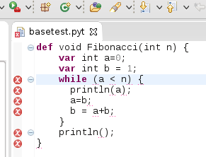

<h2>Tutorial for Implementing a Python-like Syntax using Xtext </h2>

Here we have a tutorial, with code, for the whitespaceblock project which is <a href="https://github.com/martinbaker/xtextadd/tree/master/whitespaceblock">on github here</a>. 

<h3>Why Python-like Syntax </h3>

In this tutorial we discuss how to use Xtext to implement a DSL which may have syntax constructs similar to that used by the Python language, in particular, how to implement a syntax that depends on whitespace.

When writing DSLs using Xtext we may tend to base the syntax of our DSL on the Java language. If we are writing our DSL from scratch this may possibly be the best thing to do, there are many advantages to the java syntax.  However this is Xtext and we can change the syntax however we want, you may decide that for your DSL, a more Python-like syntax is better. Reasons for this may be:

<ul>
  <li>You may be basing your DSL on an existing DSL which already uses whitespace.</li>
  <li>You may prefer the cleaner look of not having curly brackets.</li>
  <li>The end users may not want to type in curly brackets.   </li>
</ul>
<table width="600">
  <tr>
    <td>In a java-like language we have blocks of code for things like a method declaration or a 'while' construct. We delineate these blocks using curly brackets as shown on the right: </td>
    <td><table border="1">
      <tr>
        <td><pre>public void Fibonacci(int n){
    int a=0;
    int b = 1;
    while (a &lt; n) {
      println(a);
      a=b;
      b = a+b;
    }
    println();
}</pre></td>
      </tr>
    </table></td>
  </tr>
  <tr>
    <td>A first step in making this syntax more Python-like  would be to remove the curly brackets. We still know where the blocks becin and end because each block has its own level of indentation. </td>
    <td><table border="1">
        <tr>
          <td><pre>public void Fibonacci(int n)
    int a=0;
    int b = 1;
    while (a &lt; n)
      println(a);
      a=b;
      b = a+b;
    println();
</pre></td>
        </tr>
    </table></td>
  </tr>
  <tr>
    <td>
A next step would be to modify the rules that use these blocks to look more Python-like so, 
      instead of: public void Fibonacci(int n) 
      we have: def fibonacci(int n):

      
and, 
      instead of: while (a &lt; n) 
we have: while a &lt; n:
</td>
    <td><table border="1">
        <tr>
          <td><pre>def fibonacci(int n):
    int a=0;
    int b = 1;
    while a &lt; n:
      println(a);
      a=b;
      b = a+b;
    println();
  </pre></td>
        </tr>
    </table></td>
  </tr>
  <tr>
    <td>Finally we could go to a full Python syntax: </td>
    <td><table border="1">
      <tr>
        <td><pre>def fibonacci(n):
     a, b = 0, 1
     while a &lt; n:
         print(a, end=' ')
         a, b = b, a+b
     print()</pre></td>
      </tr>
    </table></td>
  </tr>
</table>
<h3>Implementing The Code</h3>

The plan here is to start with a grammar file that parses a Java-like syntax and then demonstrate how to convert that to a Python-like syntax.

The aim is not to create a fully working Python implementation but just to show how people can create their own DSL which has Python like contructs.  The main one being the use of whitespace to dilenate blocks.

My first thought, for this tutorial, would be to start with Xbase and show how to convert this to a Python-like syntax.  Here I am only really concerned with the syntax, to have a fully working Xbase requires a lot of extra code. To explain all about that in this tutorial would take a lot of time and that is not really what this tutorial is about. All I want to do here is explain how to implement a Python-like syntax. So I am going to cheat and take out some of the implementation stuff, this tutorial won't generate code or even do full validation but it will generate a working editor and I think that will be enough to show how to produce Python-like syntax. 

I have therefore taken  the XBase grammar (<a href="https://github.com/eclipse/xtext/blob/master/plugins/org.eclipse.xtext.xbase/src/org/eclipse/xtext/xbase/Xbase.xtext">which you can get from here</a>) and made the following changes:

<ul>
  <li>Remove  imports from Xbase and JavaVMTypes.</li>
  <li>Replace jvm types such as types::JvmIdentifiableElement and just use ID. </li>
  <li>Other hacks to get the grammar to compile. </li>
</ul>

<a href="https://github.com/martinbaker/xtextadd/blob/master/pbase/com.euclideanspace.pbase/steps/step2/Tutorial.xtext">Here is a pointer</a> to the resulting grammar. 

<h3>Try the Code so far. </h3>

So start by creating a new Xtext project (in Eclipse goto File-&gt;New-&gt;Xtext -&gt;Xtext project).

Go through the wizard and set the project up as usual. 

<table>
  <tr>
    <td>I have not yet got this to parse properly yet. </td>
    <td></td>
  </tr>
</table>

&nbsp;

<h2>Modifing the Syntax</h2>

&nbsp;

<table border="1">
  <tr>
    <th bgcolor="#FFFF00">Java-like</th>
    <th bgcolor="#FFFF00">Python-like</th>
  </tr>
  <tr>
    <td><pre>grammar org.eclipse.xtext.common.Terminals</pre></td>
    <td><pre>grammar org.eclipse.xtext.common2.PythonTerminals</pre></td>
  </tr>
</table>

&nbsp;

<h3>Blocks</h3>

&nbsp;

<table border="1">
  <tr>
    <th bgcolor="#FFFF00">Java-like</th>
    <th bgcolor="#FFFF00">Python-like</th>
  </tr>
  <tr>
    <td><pre>XBlockExpression returns XExpression hidden(SL_COMMENT,WS): 
	{XBlockExpression}
	'{'
		(expressions+=XExpressionOrVarDeclaration ';'?)*
	'}';</pre></td>
    <td><pre>XBlockExpression returns XExpression hidden(SL_COMMENT,WS): 
	{XBlockExpression}
	BEGIN
		(expressions+=XExpressionOrVarDeclaration ';'?)*
	END;</pre></td>
  </tr>
</table>

<h3>Terminating Statements</h3>

&nbsp;

<table border="1">
  <tr>
    <th bgcolor="#FFFF00">Java-like</th>
    <th bgcolor="#FFFF00">Python-like</th>
  </tr>
  <tr>
    <td><pre>XBlockExpression returns XExpression hidden(SL_COMMENT,WS): 
	{XBlockExpression}
	'{'
		(expressions+=XExpressionOrVarDeclaration ';'?)*
	'}';</pre></td>
    <td><pre>XBlockExpression returns XExpression hidden(SL_COMMENT,WS): 
	{XBlockExpression}
	BEGIN
		(expressions+=XExpressionOrVarDeclaration 
		('\r'|'\n')?)*
	END;</pre></td>
  </tr>
</table>

<h3>Line Continuation</h3>

&nbsp;

<table border="1">
  <tr>
    <th bgcolor="#FFFF00">Java-like</th>
    <th bgcolor="#FFFF00">Python-like</th>
  </tr>
  <tr>
    <td><pre></pre></td>
    <td>&nbsp;</td>
  </tr>
</table>

<h3>Comments</h3>

&nbsp;

<table border="1">
  <tr>
    <th bgcolor="#FFFF00">Java-like</th>
    <th bgcolor="#FFFF00">Python-like</th>
  </tr>
  <tr>
    <td><pre>// single line comment</pre></td>
    <td><pre># single line comment</pre></td>
  </tr>
</table>