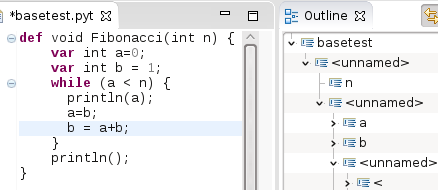
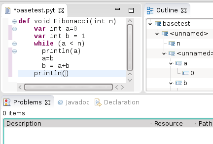

<h2>Tutorial for Implementing a Python-like Syntax using Xtext </h2>

Here we have a tutorial, with code, for the whitespaceblock project which is <a href="https://github.com/martinbaker/xtextadd/tree/master/whitespaceblock">on github here</a>. 

<table border="1" bgcolor="#99FFFF">
  <tr>
    <td>
Note:  Sebastian Zarnekow from the Xtext team has adapted this and incorporated this into Xtext. This will be available in xtext v2.8,  it will come with example language and documentation . It will be based around <a href="https://github.com/eclipse/xtext/blob/master/plugins/org.eclipse.xtext/src/org/eclipse/xtext/parser/antlr/AbstractIndentationTokenSource.java">this class</a>. Unfortunately they won't add a second terminals grammar with special python-like syntax for comments and continuation. (more info about this on <a href="https://bugs.eclipse.org/bugs/show_bug.cgi?id=451838">this thread</a>).
</td>
  </tr>
</table>
<h3>Why Python-like Syntax </h3>

In this tutorial we discuss how to use Xtext to implement a DSL which may have syntax constructs similar to that used by the Python language, in particular, how to implement a syntax that depends on whitespace.

When writing DSLs using Xtext we may tend to base the syntax of our DSL on the Java language. If we are writing our DSL from scratch this may possibly be the best thing to do, there are many advantages to the java syntax.  However this is Xtext and we can change the syntax however we want, you may decide that for your DSL, a more Python-like syntax is better. Reasons for this may be:

<ul>
  <li>You may be basing your DSL on an existing DSL which already uses whitespace.</li>
  <li>You may prefer the cleaner look of not having curly brackets.</li>
  <li>The end users may not want to type in curly brackets.   </li>
</ul>
<table width="600">
  <tr>
    <td>
In a java-like language we have blocks of code for things like a method declaration or a 'while' construct. We delineate these blocks using curly brackets (also known as braces) as shown on the right: 

      
That is, when the indent increases then a block starts and when the indent goes back to the previous value the block ends. 
</td>
    <td><table border="1">
      <tr>
        <td><pre>public void Fibonacci(int n){
    int a=0;
    int b = 1;
    while (a &lt; n) {
      println(a);
      a=b;
      b = a+b;
    }
    println();
}</pre></td>
      </tr>
    </table></td>
  </tr>
  <tr>
    <td>A first step in making this syntax more Python-like  would be to remove the curly brackets. We still know where the blocks begin and end because each block has its own level of indentation. </td>
    <td><table border="1">
        <tr>
          <td><pre>public void Fibonacci(int n)
    int a=0;
    int b = 1;
    while (a &lt; n)
      println(a);
      a=b;
      b = a+b;
    println();
</pre></td>
        </tr>
    </table></td>
  </tr>
  <tr>
    <td>
A next step would be to modify the rules that use these blocks to look more Python-like so, 
      instead of: public void Fibonacci(int n) 
      we have: def fibonacci(int n):

      
and, 
      instead of: while (a &lt; n) 
we have: while a &lt; n:
</td>
    <td><table border="1">
        <tr>
          <td><pre>def fibonacci(int n):
    int a=0;
    int b = 1;
    while a &lt; n:
      println(a);
      a=b;
      b = a+b;
    println();
  </pre></td>
        </tr>
    </table></td>
  </tr>
  <tr>
    <td>Finally we could go to a full Python syntax: </td>
    <td><table border="1">
      <tr>
        <td><pre>def fibonacci(n):
     a, b = 0, 1
     while a &lt; n:
         print(a, end=' ')
         a, b = b, a+b
     print()</pre></td>
      </tr>
    </table></td>
  </tr>
</table>
<h3>Implementing The Code</h3>

The plan here is to start with a grammar file that parses a Java-like syntax and then demonstrate how to convert that to a Python-like syntax.

The aim is not to create a fully working Python implementation but just to show how people can create their own DSL which has Python-like constructs.  The main one being the use of whitespace to delineate blocks.

My first thought, for this tutorial, would be to start with Xbase and show how to convert this to a Python-like syntax.  Here I am only really concerned with the syntax, to have a fully working Xbase requires a lot of extra code. To explain all about that in this tutorial would take a lot of time and that is not really what this tutorial is about. All I want to do here is explain how to implement a Python-like syntax. So I am going to cheat and take out some of the implementation stuff, this tutorial won't generate code or even do full validation but it will generate a working editor and I think that will be enough to show how to produce Python-like syntax. 

I have therefore taken  the XBase grammar (<a href="https://github.com/eclipse/xtext/blob/master/plugins/org.eclipse.xtext.xbase/src/org/eclipse/xtext/xbase/Xbase.xtext">which you can get from here</a>) and made the following changes:

<ul>
  <li>Remove  imports from Xbase and JavaVMTypes.</li>
  <li>Replace jvm types such as types::JvmIdentifiableElement and just use ID. </li>
  <li>Other hacks to get the grammar to compile. </li>
</ul>

<a href="https://github.com/martinbaker/xtextadd/blob/master/pbase/com.euclideanspace.pbase/steps/step2/Tutorial.xtext">Here is a pointer</a> to the resulting grammar. An alternative would be to use the <a href="https://github.com/martinbaker/xtextadd/tree/master/xgener">program described on the page here</a> to create a suitable grammar. 

<h3>Try the Code so far. </h3>
<table>
  <tr>
    <td>
So start by creating a new Xtext project (in Eclipse goto File-&gt;New-&gt;Xtext -&gt;Xtext project).

      <ul>
        <li>Go through the wizard and set the project up as usual.</li>
        <li>Copy the contents of the <a href="https://github.com/martinbaker/xtextadd/blob/master/pbase/com.euclideanspace.pbase/steps/step2/Tutorial.xtext">grammar discussed above from here </a> to the xtext grammar file in the project.</li>
        <li>Run mwe2 to build the project. Choose an extension for your project, I chose 'pyt' . </li>
        <li>Run the project in new Eclipse window.</li>
        <li>Create a new file with the extension you chose (in my case 'pyt') and enter a method with java syntax like this: </li>
    </ul></td>
    <td><table border="1">
      <tr>
        <td><pre>def void Fibonacci(int n) {
    var int a=0;
    var int b = 1;
    while (a &lt; n) {
      println(a);
      a=b;
      b = a+b;
    }
    println();
} </pre></td>
      </tr>
    </table></td>
  </tr>
</table>
<table>
  <tr>
    <td>Confirm that this does not have any errors:  </td>
    <td></td>
  </tr>
</table>

We can now start gradually converting this  Java syntax to Python syntax. 

<h2>Modifying the Syntax</h2>

In order to do move toward Python we first need to change the terminals as discussed on <a href="https://github.com/martinbaker/xtextadd/tree/master/whitespaceblock">page here</a>. 

I am hoping that this will be built into Xtext so that we can just import a different terminals file, like this: 

<table border="1">
  <tr>
    <th bgcolor="#FFFF00">Java-like</th>
    <th bgcolor="#FFFF00">Python-like</th>
  </tr>
  <tr>
    <td><pre>grammar org.eclipse.xtext.common.Terminals</pre></td>
    <td><pre>grammar org.eclipse.xtext.common2.PythonTerminals</pre></td>
  </tr>
</table>

We also need to use a <a href="https://github.com/martinbaker/xtextadd/blob/master/pbase/com.euclideanspace.pbase/src/com/euclideanspace/pbase/PythonesqueTokenSource.java">customised token source</a> also  discussed on <a href="https://github.com/martinbaker/xtextadd/tree/master/whitespaceblock">page here</a>. I am hoping this will eventually be built into Xtext and I am hoping that using the PythonTerminals grammar will automatically install the customised TokenSource but, for now, we will have to add it in manually.

<h4>Customised TokenSource</h4>
<ul>
  <li>We therefore add a class to represent 'phantom' tokens this class is here: <a href="https://github.com/martinbaker/xtextadd/blob/master/pbase/com.euclideanspace.pbase/src/com/euclideanspace/pbase/PhantomToken.java">PhantomToken</a>. Add it to your project.</li>
  <li>Next we need to  add the code that inserts these phantom tokens when needed, this is the <a href="https://github.com/martinbaker/xtextadd/blob/master/pbase/com.euclideanspace.pbase/src/com/euclideanspace/pbase/PythonesqueTokenSource.java">customised token source</a> so you also need to add that to your project.</li>
  <li>In order to use this customised TokenSource we need to customise the <a href="https://github.com/martinbaker/xtextadd/blob/master/pbase/com.euclideanspace.pbase/src/com/euclideanspace/pbase/TutorialParser.java">parser</a> and in <a href="https://github.com/martinbaker/xtextadd/blob/master/pbase/com.euclideanspace.pbase/src/com/euclideanspace/pbase/TutorialRuntimeModule.java">TutorialRuntimeModule.java</a> / <a href="https://github.com/martinbaker/xtextadd/blob/master/pbase/com.euclideanspace.pbase/src/com/euclideanspace/pbase/TutorialStandaloneSetup.java">TutorialStandaloneSetup.java</a> . Make sure the modified versions of all these are in your project. </li>
</ul>
<h4>Customised TokenSource in UI </h4>

Now the 'contentassist' parser in the ui needs to be modified in the same way as the main parser. I was hoping this would fix <a href="https://github.com/martinbaker/xtextadd/blob/master/pbase/notes/troubleshooting.md#XtextReconcilerJob">this error</a> (<em>An internal error occurred during: &quot;XtextReconcilerJob&quot;</em>) but I am still getting this error. 

<ul>
  <li>We therefore put another copy of the: <a href="https://github.com/martinbaker/xtextadd/blob/master/pbase/com.euclideanspace.pbase.ui/src/com/euclideanspace/pbase/ui/PhantomToken.java">PhantomToken</a> class in the UI project .</li>
  <li>We also need to  add  another copy of the <a href="https://github.com/martinbaker/xtextadd/blob/master/pbase/com.euclideanspace.pbase.ui/src/com/euclideanspace/pbase/ui/PythonesqueTokenSource.java">customised token source</a> in the UI project.</li>
  <li>In order to use this customised TokenSource we need to customise the <a href="https://github.com/martinbaker/xtextadd/blob/master/pbase/com.euclideanspace.pbase.ui/src/com/euclideanspace/pbase/ui/TutorialUIParser.java">parser</a> and in <a href="https://github.com/martinbaker/xtextadd/blob/master/pbase/com.euclideanspace.pbase.ui/src/com/euclideanspace/pbase/ui/TutorialUiModule.java">TutorialUiModule.java</a>. Make sure the modified versions of all these are in your project.</li>
</ul>
<h4>Serializer</h4>
<table>
  <tr>
    <td>So far we have setup the Lexer/Parser which turns text into EMF model. The serializer works in the other direction (EMF model -&gt; text). In TutorialSyntacticSequencer which extends AbstractSyntacticSequencer we have code which returns text representation of BEGIN and END as you can see on the right:</td>
    <td><table border="1">
      <tr>
        <td><pre>	/**
	 * terminal BEGIN : '{|';
	 */
	protected String getBEGINToken(EObject semanticObject,
                                            RuleCall ruleCall, INode node) {
		if (node != null)
			return getTokenText(node);
		return &quot;{|&quot;;
	}
	
	/**
	 * terminal END : '|}';
	 */
	protected String getENDToken(EObject semanticObject, 
                                         uleCall ruleCall, INode node) {
		if (node != null)
			return getTokenText(node);
		return &quot;|}&quot;;
	}</pre></td>
      </tr>
    </table></td>
  </tr>
</table>

This textual representation is only intended to be used internally in the EMF model so I don't think we want that returned here? I have therefore overridden this <a href="https://github.com/martinbaker/xtextadd/blob/master/pbase/com.euclideanspace.pbase/src/com/euclideanspace/pbase/TutorialOverrideSyntacticSequencer.java">in class here</a> to return empty string. If your application makes use of serialisation then I suspect you should really implement Xtext formatting (Pretty Printing)

capability using the IFormatter service.

So put this code into the project. We need to bind this code in TutorialRuntimeModule<a href="https://github.com/martinbaker/xtextadd/blob/master/pbase/com.euclideanspace.pbase/src/com/euclideanspace/pbase/TutorialRuntimeModule.java"> here</a>. 

We can now go on to modify the grammar syntax: 

<h3>Blocks</h3>

The main thing we want to do is delineate blocks using whitespace. As discussed already, most of the work for this is done in the customised TokenSource.

<table border="1">
  <tr>
    <th bgcolor="#FFFF00">Java-like</th>
    <th bgcolor="#FFFF00">Python-like</th>
  </tr>
  <tr>
    <td><pre>XBlockExpression returns XExpression hidden(SL_COMMENT,WS): 
	{XBlockExpression}
	'{'
		(expressions+=XExpressionOrVarDeclaration ';'?)*
	'}';</pre></td>
    <td><pre>XBlockExpression returns XExpression hidden(SL_COMMENT,WS): 
	{XBlockExpression}
	BEGIN
		(expressions+=XExpressionOrVarDeclaration ';'?)*
	END;</pre></td>
  </tr>
</table>

In the grammar we replace '{' and '}' by BEGIN and END. Of course the user does not have to type BEGIN and END, these are added automatically by our TokenSource class when the indent level changes. Each time we increase the indent TokenSource puts this on a stack (pile) to make sure that the indents are unwound correctly. 

<table>
  <tr>
    <td>So, to implement this add something like this: 
    into your grammar file. Then change '{' and '}' to BEGIN and END as discussed above. </td>
    <td><table border="1">
      <tr>
        <td><pre>/* phantom tokens:
 * use something other than '{' and '}' to avoid
 * clash in Python so we use '{|' and '|}' 
 * TODO Should really use something more
 * obscure to avoid clash in any user language
 */
terminal BEGIN : '{|';
terminal END : '|}';
</pre></td>
      </tr>
    </table></td>
  </tr>
</table>

If you don't want to type these changes in by hand, I have put these changes into the  <a href="https://github.com/martinbaker/xtextadd/blob/master/pbase/com.euclideanspace.pbase/steps/step3/Tutorial.xtext">grammar file here</a>.

<table>
  <tr>
    <td>
We can then run our code in a new instance of Eclipse, remove the curly brackets and confirm that this parses correctly:

    </td>
    <td></td>
  </tr>
</table>
<h3>Terminating Statements</h3>

Java-like languages use a semicolon ';' to mark the termination of a statement. In a more Python-like DSL we may want a new-line to mark the termination of a statement. One way to approach this is to split the terminal WS (whitespace) into two parts: SP for space and tab and NL for newline and carriage return. We can the replace ';' in the grammar by NL. This is shown in the following example: 

<table border="1">
  <tr>
    <th bgcolor="#FFFF00">Java-like</th>
    <th bgcolor="#FFFF00">Python-like</th>
  </tr>
  <tr>
    <td><pre>XBlockExpression returns XExpression hidden(SL_COMMENT,WS): 
	{XBlockExpression}
	'{'
		(expressions+=XExpressionOrVarDeclaration ';'?)*
	'}';
	
	where:
	
	terminal WS : (' '|'\t'|'\r'|'\n')+;</pre></td>
    <td><pre>XBlockExpression returns XExpression hidden(SL_COMMENT,SP): 
	{XBlockExpression}
	BEGIN
		(expressions+=XExpressionOrVarDeclaration  NL?)*
	END;	
	
where:
	
	terminal SP : (' '|'\t')+;
	terminal NL : ('\r'|'\n')+;</pre>
</td>
  </tr>
</table>

The problem with this approach is that we can no longer make NL hidden because it is now a significant part of the grammar. This means that the grammar must explicitly handle empty lines and situations like that.

A much neater way would be to  process this in our custom TokenSource class and use this to insert a PhantomToken containing ';'. This would mean that we could leave the grammar as it is in our Java-like syntax.

In order to handle this in our custom TokenSource class we need it to insert a phantom ';' before every new-line, except:

<ul>
  <li>When the indent level increases (don't put ';' after '{').</li>
  <li>On a blank line.</li>
  <li>On a line containing only a comment    . </li>
  <li>When the last significant character was a ';' (that is, no need for two semicolons in a row).</li>
  <li>After a backslash  (see line continuation below). </li>
  <li>Inside parentheses, brackets and braces (see line continuation below).</li>
</ul>

However, in order to implement this in TokenSource we need lookahead which is not currently possible in TokenSource.

<table>
  <tr>
    <td>
For the example we are using in this tutorial no changes are needed to the grammar or TokenSource.

      
So I ran the previous  code in a new instance of Eclipse and removed all the semicolons. The code continued to parse correctly.

      
This is because the code in this tutorial is based on Xbase, in Xbase semicolons are optional.

      
However, in your DSL, it may be difficult to write a grammar without terminators for statements, in which case you may need to change TokenSource as described above. 
</td>
    <td></td>
  </tr>
</table>
<h3>Line Continuation</h3>

It is not good practice to have excessively long lines in our source code. In a Java-like DSL we can insert whitespace wherever we want, but in a Python-like DSL newlines are significant so we need specific mechanisms for inserting lines: 

<h4>Backslash continuation </h4>
<table border="1">
  <tr>
    <th bgcolor="#FFFF00">Java-like</th>
    <th bgcolor="#FFFF00">Python-like</th>
  </tr>
  <tr>
    <td><pre>int a = 1 +2 + 3 +
    4 + 5;</pre></td>
    <td><pre>a = 1 +2 + 3 + \
    4 + 5</pre></td>
  </tr>
</table>
<h4>Continuation lines</h4>

If we include a new line  inside parentheses, brackets and braces, then we do not need to explicitly use a backslash. So our custom TokenSource needs to count parentheses, brackets and braces (remember braces in Python don't indicate blocks) to know what is a continuation line. 

A variation of this is 'hanging indentation' where all the lines in a paragraph are indented except the first line. In the context of Python, the term is used to describe a style where the opening parenthesis of a parenthesized statement is the last non-whitespace character of the line, with subsequent lines being indented until the closing parenthesis.

<h3>Comments</h3>

Python-like languages use hash '#' to indicate a comment, changing '//' to '#' in the grammar is trivial: 

<table border="1">
  <tr>
    <th bgcolor="#FFFF00">Java-like</th>
    <th bgcolor="#FFFF00">Python-like</th>
  </tr>
  <tr>
    <td><pre>// single line comment</pre></td>
    <td><pre># single line comment</pre></td>
  </tr>
</table>

However there are some variations that we have to be careful of:

<ul>
  <li>We don't want blocks to be created around comments and we don't want comments to end blocks therefore, if a line contains only a comment, then we ignore its indent in block determination.</li>
  <li>We handle inline and block comments as described below.  </li>
</ul>
<h4>Inline Comments</h4>

If we allow 'inline comments' in out DSL, that is, comments on same line as the code: 

<table border="1">
  <tr>
    <td><pre>while a &lt; n:                 # Continue until we have n terms </pre></td>
  </tr>
</table>

Inline comments have an implicit new-line (which is a significant part of the syntax) so we must make sure that they are treated in the same way as new lines in the grammar. 

<h4>Block Comments</h4>

Block comments are multi-line comments (equivalent to /* comment*/ in Java). Each line of a block comment starts with a # and a single space, I cant see any reason why this should not be parsed as if it were multiple single-line comments.

<h2>Known Problems</h2>

I sometimes get the <a href="https://github.com/martinbaker/xtextadd/blob/master/pbase/notes/troubleshooting.md#XtextReconcilerJob">this error</a> (<em>An internal error occurred during: &quot;XtextReconcilerJob&quot;</em>) when editing the DSL source code. Although the editor continues to work, getting random error messages is confusing for the user, so  this needs to be sorted out.  I have reported this bug to Xtext <a href="https://bugs.eclipse.org/bugs/show_bug.cgi?id=455908">here</a> . There is a workaround as follows:

<h4>Cause</h4>

This is because the method: insertChangeIntoReplaceRegion(ICompositeNode rootNode, ReplaceRegion region)

in class: org.eclipse.xtext.parser.impl.PartialParsingHelper

Sometimes gets called with the parameter 'rootNode' not set to root node but to a CompositeNode inside the root node.

<h4>Fix</h4>

Changing the insertChangeIntoReplaceRegion method as follows fixes the problem:

<pre>/**
 * @author Martin Baker - fix for reconciler error.
 * This is being called with the parameter 'rootNode' not set to root node
 * I have therefore added getRootNode() call.
 */
public String insertChangeIntoReplaceRegion(ICompositeNode rootNode, ReplaceRegion region) {
  ICompositeNode reallyrootNode = rootNode.getRootNode();
  final StringBuilder builder = new StringBuilder(reallyrootNode.getText());
  region.shiftBy(0-reallyrootNode.getTotalOffset()).applyTo(builder);
  return builder.toString();
}
</pre>

I have put the code for this <a href="https://github.com/martinbaker/xtextadd/blob/master/pbase/com.euclideanspace.pbase/src/com/euclideanspace/pbase/TutorialPartialParsingHelper.java">here</a>. We need to bind this code in TutorialRuntimeModule<a href="https://github.com/martinbaker/xtextadd/blob/master/pbase/com.euclideanspace.pbase/src/com/euclideanspace/pbase/TutorialRuntimeModule.java"> here</a>. 

So include this in the project. 

<h2>Future Enhancements</h2>

Xtext provides a fair degree of decoupling between the syntax and the semantics. It would be really good if, in the future, a chunk of code such as Xbase could have the ability to plug in different syntax such as a Java-like syntax and a Python-like syntax where both would have exactly the same functionality.  
